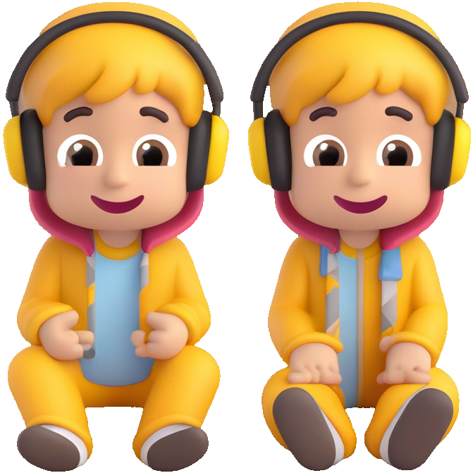

# 🪺 StoryNest


**A cozy home for bedtime stories, read aloud for kids.**  

StoryNest is a friendly command-line interface (CLI) powered by [Cobra (Go)](https://github.com/spf13/cobra) that helps you browse, select, and listen to stories—with flexible voice options and interactive mode.

----



## Features

- 📚 Browse and read stories by ID or via an interactive prompt
- 🗣️ Optionally specify TTS voice using command-line flags
- 🏛️ Manage story libraries (e.g. Project Gutenberg)
- ⚙️ Adjust TTS-related settings like voice, speed, and volume

---

## Installation

```bash
git clone https://github.com/tahcohcat/storynest.git
cd storynest
go build -o storynest ./cmd/main.go
```

This will generate a storynest executable.

## Usage Examples

### Read a Story by ID with a Voice of Your Choice
```bash
./storynest read gutenberg-113 --voice "en-GB-Chirp3-HD-Vindemiatrix"
```

### Read a Story Interactively

```bash
./storynest read --interactive
```

### Browse Available Libraries
```bash
./storynest libraries
```

### Adjust Settings (Voice, Speed, Volume)
```bash
./storynest settings
```
Settings are persisted so you don't need to re-specify them every time.

## Commands Overview

| Command     | Description                                                       |
|-------------|-------------------------------------------------------------------|
| `read`      | Read a specific story by ID, optionally via interactive selection |
| `libraries` | Add, remove, or list story libraries                              |
| `settings`  | Configure TTS settings like voice, speed, volume                  |
| `list`      | List stories with optional filters (genre, age)                   |
| `random`    | Read a randomly selected story                                    |


## Development

### Clone the repository:
```bash
git clone https://github.com/tahcohcat/storynest.git
cd storynest
```

### Build the CLI:
```bash
go build -o storynest ./cmd/main.go
```

### Run commands (see usage and help for options):
```bash
./storynest read --help
```

## Acknowledgements

Powered by Go, Cobra, TTS engines, and community-built libraries like Project Gutenberg.
